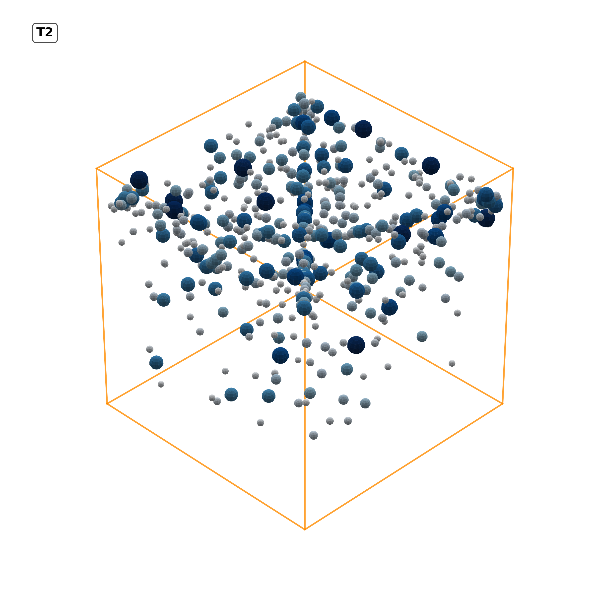
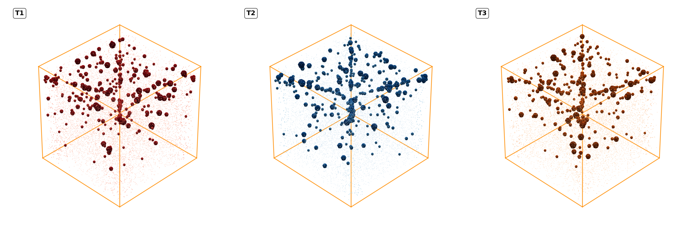
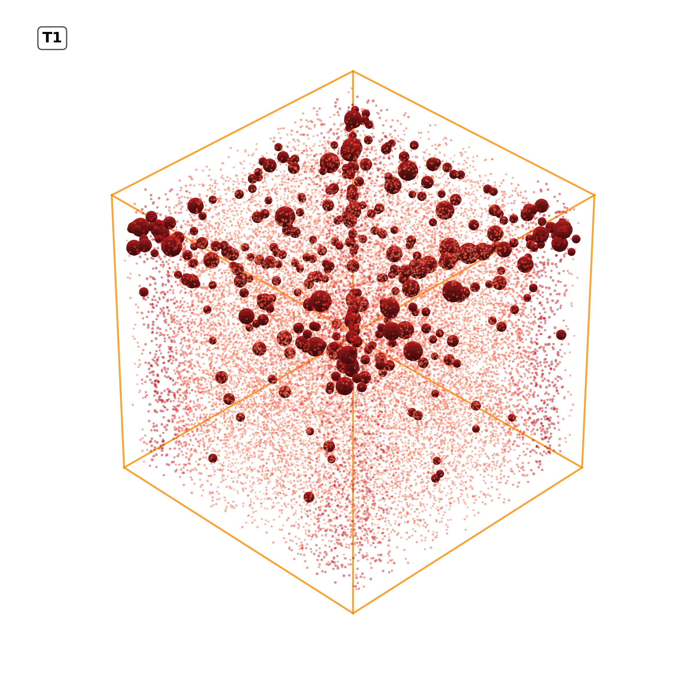

# 3D Pore Distribution Modeling for CSA Cement-Based Insulating Boards

**Experimental and Modeling Assessment of Thermal Properties of Calcium Sulfoaluminate Cement-Based Insulating Boards Utilizing Agriculture Waste Products**

A comprehensive Python-based system for 3D computational modeling and visualization of pore structures in thermal insulating boards made from calcium sulfoaluminate (CSA) cement and agricultural waste materials.

## Research Overview

This project provides advanced 3D visualization and computational modeling capabilities for analyzing pore distribution patterns in experimental thermal insulating boards. The system generates realistic pore structure models based on mercury intrusion porosimetry (MIP) data, enabling detailed analysis of material porosity characteristics that directly influence thermal performance.

## Experimental Materials

### Thermal Insulating Board Compositions

- **T1 Board**: Expanded vermiculite + CSA cement + water
  - Base composition with primary insulating material and binder
- **T2 Board**: Expanded vermiculite + rice husk ash + moso bamboo fiber + CSA cement + water
  - Enhanced composition incorporating agricultural waste materials for improved performance
- **T3 Board**: Expanded vermiculite + rice husk ash (high quantity) + moso bamboo fiber (high quantity) + CSA cement + water
  - Optimized composition with increased agricultural waste content for maximum sustainability

### Testing Methodology

Mercury intrusion porosimetry (MIP) testing was conducted on all board samples to characterize pore size distribution, total porosity, and pore connectivity. The experimental data provides the foundation for computational modeling and 3D visualization of pore structures.

## Computational Features

- **Individual Board Modeling**: Detailed 3D pore structure visualization for each board composition (T1, T2, T3)
- **Comparative Analysis**: Side-by-side visualizations enabling direct comparison of pore characteristics
- **Density-Based Modeling**: Layered density representations showing spatial distribution of porosity
- **Matrix-Filled Modeling**: Dense granular material representations simulating filled pore spaces
- **Hybrid Visualizations**: Combined models showing both discrete pores and matrix material
- **Advanced Statistical Analysis**: Volume histograms, sphericity analysis, and detailed pore characterization
- **Custom Dimensional Analysis**: Flexible board dimensions for specialized applications
- **Modular Architecture**: Clean, organized code structure with separate modules for each modeling approach

## Project Structure

```
simple_pore/
├── app/                           # Computational modeling modules
│   ├── __init__.py               # Package initialization
│   ├── data_processor.py         # MIP data loading and processing
│   ├── utils.py                  # Common utilities and geometric framework
│   ├── individual_viz.py         # Individual board pore modeling
│   ├── combined_viz.py           # Comparative board analysis
│   ├── density_viz.py            # Density-based pore distribution modeling
│   ├── sand_dust_viz.py          # Matrix-filled pore space modeling
│   └── combined_pores_sand_viz.py # Hybrid pore-matrix modeling
├── dataset/                      # Mercury intrusion porosimetry data (not tracked in git)
│   └── pore_data.csv            # Experimental pore size distribution data
├── out/                          # Generated models and visualizations (not tracked in git)
│   ├── T1_individual_clean.png   # T1 board pore structure model
│   ├── T2_individual_clean.png   # T2 board pore structure model
│   ├── T3_individual_clean.png   # T3 board pore structure model
│   ├── combined_three_samples_clean.png  # Comparative analysis
│   ├── density_filled_clean.png  # Density-based modeling
│   ├── matrix_filled_clean.png   # Matrix-filled pore modeling
│   ├── T1_pores_matrix_combined.png  # T1 hybrid model
│   ├── T2_pores_matrix_combined.png  # T2 hybrid model
│   ├── T3_pores_matrix_combined.png  # T3 hybrid model
│   └── combined_pores_matrix_filled.png  # Combined hybrid models
├── main.py                       # Main computational modeling script
├── .gitignore                    # Git ignore rules
└── README.md                     # This documentation
```

## Installation and Setup

### Prerequisites

- Python 3.8 or higher
- Virtual environment (recommended)

### Installation Steps

1. Clone the repository:

```bash
git clone https://github.com/Hetawk/pore.git
cd pore
```

2. Create and activate a virtual environment:

```bash
python3 -m venv .venv
source .venv/bin/activate  # On Windows: .venv\Scripts\activate
```

3. Install required computational libraries:

```bash
pip install pandas numpy matplotlib scipy tqdm
```

## Quick Start Commands

The system provides a convenient command-line interface for rapid analysis through the `quick_config.sh` script. This allows researchers to quickly generate different types of visualizations without manual configuration.

### Basic Analysis Commands

```bash
# Default configuration (160×160×40 mm boards)
./quick_config.sh default

# Small specimen analysis (10±1mm diameter samples)
./quick_config.sh small-specimen

# Fast analysis with reduced quality for quick previews
./quick_config.sh fast

# Publication-quality high-resolution output
./quick_config.sh publication
```

### Dimensional Analysis Commands

```bash
# Large board analysis (300×300×80 mm)
./quick_config.sh large-board

# Tall board analysis (160×160×80 mm - double thickness)
./quick_config.sh tall

# Custom vertical dimensions (40×40×160 mm)
./quick_config.sh dimension

# Cubic dimensions (100×100×100 mm)
./quick_config.sh dim100

# Cubic with single-color pores (no size-based legends)
./quick_config.sh dim100color0

# Cubic with single-color pores and advanced analysis
./quick_config.sh dim100color0advanced
```

### Color-Enhanced Visualizations

```bash
# Colored pore size categories (pink/yellow/cyan)
./quick_config.sh color

# Alternative RGB color scheme (red/green/blue)
./quick_config.sh color2
```

### Advanced Statistical Analysis

```bash
# Advanced pore analysis with statistical distributions
./quick_config.sh advanced

# Advanced analysis includes:
# - Volume histogram analysis
# - Sphericity distribution
# - 3D statistical plots with colorbar
# - Enhanced pore characterization
```

### Custom Parameter Analysis

```bash
# Custom configuration with specific parameters
./quick_config.sh custom --diameter 15 --thickness 8 --dpi 600

# Available custom parameters:
# --length, --width, --thickness: Board dimensions (mm)
# --diameter, --tolerance: For cylindrical specimens
# --pores-all: Total pore count for all visualizations
# --pores-individual, --pores-comparative: Specific visualization pore counts
# --min-pore-radius, --max-pore-radius: Pore size range
# --dpi: Output resolution
# --figure-size: Plot dimensions (e.g., "12,8")
# --elevation, --azimuth: 3D viewing angles
# --alpha: Transparency level
# --advanced-analysis: Enable/disable advanced features
```

## Command Reference Guide

### Standard Configurations

| Command          | Board Size (mm) | Pore Counts | Features       | Use Case         |
| ---------------- | --------------- | ----------- | -------------- | ---------------- |
| `default`        | 160×160×40      | Standard    | Basic analysis | General research |
| `small-specimen` | Ø10×10          | Reduced     | High DPI       | Small samples    |
| `publication`    | 160×160×40      | Standard    | 600 DPI, PDF   | Publications     |
| `fast`           | 160×160×40      | Reduced     | 150 DPI        | Quick preview    |

### Dimensional Variants

| Command       | Board Size (mm) | Aspect Ratio | Specialty            |
| ------------- | --------------- | ------------ | -------------------- |
| `large-board` | 300×300×80      | 3.75:3.75:1  | Large specimens      |
| `tall`        | 160×160×80      | 2:2:1        | Thick boards         |
| `dimension`   | 40×40×160       | 0.25:0.25:1  | Vertical orientation |
| `dim100`      | 100×100×100     | 1:1:1        | Cubic specimens      |

### Advanced Analysis Features

| Command                | Color Scheme     | Legends    | Advanced Stats | Target Application        |
| ---------------------- | ---------------- | ---------- | -------------- | ------------------------- |
| `color`                | Pink/Yellow/Cyan | Size-based | No             | Color-coded visualization |
| `color2`               | Red/Green/Blue   | Size-based | No             | High-contrast analysis    |
| `advanced`             | Red/Green/Blue   | Size-based | Yes            | Statistical analysis      |
| `dim100color0`         | Sample-specific  | None       | No             | Clean presentation        |
| `dim100color0advanced` | Sample-specific  | None       | Yes            | Complete analysis         |

## Output File Structure

Each analysis command generates a comprehensive set of visualization files:

### Standard Output Files

- **Individual Board Models**:
  - `T1_individual_clean.png`, `T2_individual_clean.png`, `T3_individual_clean.png`: Cleaned individual board pore structure models
  - `T1_individual.png`, `T2_individual.png`, `T3_individual.png`: Raw individual board pore structure models
- **Comparative Analysis**:
  - `combined_three_samples_clean.png`: Cleaned comparative analysis of all three board compositions
  - `combined_three_samples.png`: Raw comparative analysis image
- **Density-Based Modeling**:
  - `density_filled_clean.png`: Cleaned density-based pore distribution model
  - `density_filled.png`: Raw density-based model
- **Matrix-Filled Modeling**:
  - `matrix_filled_clean.png`: Cleaned matrix-filled pore modeling
  - `matrix_filled.png`: Raw matrix-filled model
- **Hybrid Modeling**:
  - `T1_pores_matrix_combined.png`, `T2_pores_matrix_combined.png`, `T3_pores_matrix_combined.png`: T1, T2, T3 hybrid models
  - `combined_pores_matrix_filled.png`: Combined hybrid models with pores and matrix material

### Advanced Output Files

- **Statistical Analysis Outputs** (for `advanced` command):

  - Volume histograms and sphericity analysis results
  - 3D statistical plots with color mapping
  - Enhanced pore characterization data

- **Custom Parameter Outputs**:
  - Configurable outputs based on user-defined parameters (e.g., custom dimensions, pore sizes)

## Example Visualizations

### 1. Individual Board Pore Structure



_Figure 1: 3D pore structure model of the T1 board composition, showing the distribution and connectivity of pores._

### 2. Comparative Pore Analysis



_Figure 2: Side-by-side comparison of pore structures in T1, T2, and T3 boards, highlighting differences in pore size and distribution._

### 3. Density-Based Pore Distribution


_Figure 3: Density-based modeling results, illustrating the spatial distribution of pore density across the board thickness._

### 4. Matrix-Filled Pore Modeling


_Figure 4: Matrix-filled pore space modeling, simulating the dense packing of materials within the board._

### 5. Hybrid Pore-Matrix Modeling



_Figure 5: Hybrid model of the T1 board, combining discrete pore structures with the surrounding matrix material._

## Research Applications

This computational modeling system enables:

- **Thermal Property Prediction**: Correlation between pore structure and thermal conductivity
- **Material Optimization**: Systematic evaluation of composition effects on porosity
- **Quality Control**: Standardized visualization for material characterization
- **Educational Visualization**: Clear representation of microstructural concepts
- **Research Publication**: High-quality figures for scientific documentation

## Future Development Opportunities

- **AI/ML Integration**: Machine learning models for pore distribution prediction
- **Finite Element Integration**: Coupling with thermal simulation software
- **Multi-scale Modeling**: Integration of nano, micro, and macro-scale features
- **Interactive Visualization**: Web-based tools for real-time parameter adjustment
- **Experimental Correlation**: Direct integration with thermal testing data

## Contributing to Research

This project welcomes contributions from researchers working on:

1. **Materials Science**: Enhanced pore characterization methods
2. **Computational Modeling**: Advanced algorithms for microstructure simulation
3. **Thermal Engineering**: Integration with heat transfer analysis
4. **Sustainable Materials**: Agricultural waste utilization in construction materials
5. **Data Visualization**: Improved scientific visualization techniques

### Development Workflow

1. Fork the repository
2. Create a research branch (`git checkout -b research/feature-name`)
3. Implement and test your contributions
4. Update documentation and add test cases
5. Submit a pull request with detailed description

## License and Citation

This project is licensed under the MIT License - see the LICENSE file for details.

### Citation

If you use this computational modeling system in your research, please cite:

```
[Your Name et al.] "Experimental and modeling assessment of the thermal properties of calcium sulfoaluminate cement-based insulating boards utilizing agriculture waste product" [Journal/Conference] (Year)
```

## Acknowledgments

- **Research Focus**: Thermal insulating board characterization and modeling
- **Application Domain**: Sustainable construction materials with agricultural waste
- **Computational Approach**: 3D pore structure modeling from experimental MIP data
- **Scientific Impact**: Enhanced understanding of porosity-thermal property relationships

```bash

./quick_config.sh color
./quick_config.sh color2

```
